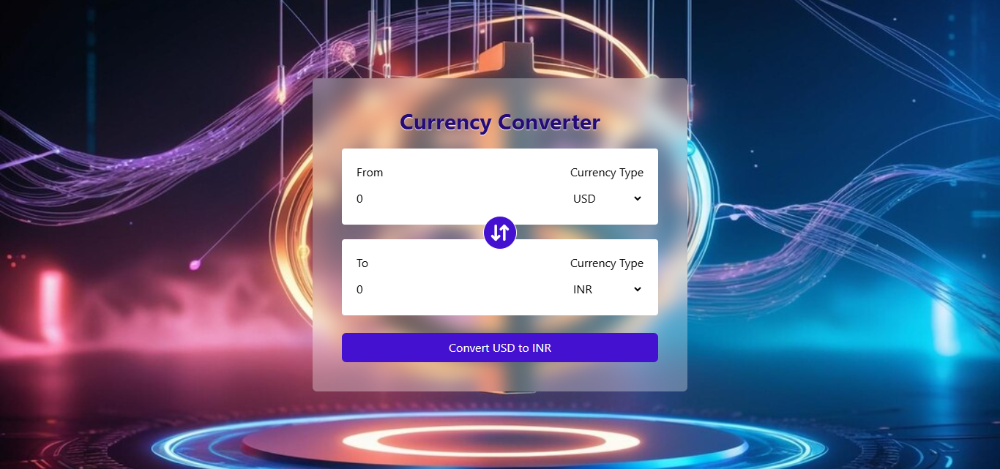

# 💱 Currency Converter

A modern **Currency Converter** application built with **React**. It features real-time currency conversion using a live exchange rate API, a clean UI with components, a custom React hook for logic management, and a swap feature to switch between "From" and "To" currencies.

---

## 🚀 Features

- 🌍 Real-time currency exchange rates
- 🔁 Swap feature to reverse currencies
- 🧩 Modular components for reusability
- 🪝 Custom React hook for fetching and managing exchange data
- 📱 Responsive and user-friendly design

---

## 🛠️ Tech Stack

- **Frontend:** React (Functional Components + Hooks)
- **Styling:** TailwindCSS
- **API:** [Exchange Rate API] (https://open.er-api.com/v6/latest)
- **Tools:** Fetch API

---

## 📸 Screenshots

---

## 📦 Installation

### Clone the repository
    git clone https://github.com/sandeepcodelab/currencyConverter.git

### Navigate to the project directory
    cd currencyConverter

### Install the dependencies
    npm install

### Start the development server
    npm run dev

